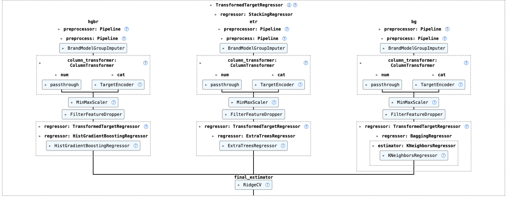

# Car Price Prediction Project
**Repository:** https://github.com/alexmr-ds/price_predictor

This project aims to develop a robust machine learning model capable of accurately predicting used car prices. The dataset is provided and includes a range of vehicle attributes such as mileage, year, engine size, transmission type, and brand, which serve as predictors in the modelling process.

## Reproducing the Project Environment
This project includes an environment.yml file that specifies the exact Conda environment used during development. This ensures full reproducibility of the results and consistency across different machines.
1. Create the environment
```
conda env create -f environment.yml
```
2. Activate the environemt 
```
conda activate car_price_env
```

## Project Organization
```
car_price_predictor/
│
├── data/                          # All project data
│   ├── raw/                       # Original, immutable dataset
│   ├── cleaned/                   # Cleaned data (fixed misspellings and inconsistencies)
│   └── processed/                 # Fully transformed datasets for modeling
│       ├── full_preprocessor/     # Output of the final preprocessing pipeline
│       ├── pre_pipeline/          # Outputs from the initial preprocessing pipeline
│       └── test_predictions/      # Predictions of each model on the test set
│
├── images/                        # Contains only the ensemble pipeline image
│
├── notebooks/                     # Jupyter notebooks for EDA and model development
│   ├── data_cleaning.ipynb        # Notebook for dataset cleaning
│   └── models/                    # Contains all trained and evaluated model notebooks
│
├── src/                           # Source code for the project
│   ├── models/                    # Exported trained models (.joblib)
│       └── random_search/         # Param grid and random search best parameters
│   └── project_utils/             # Project modules and utilities
│       ├── cleaning_utils.py      # Functions related to data cleaning
│       ├── custom_transformers.py # Custom sklearn transformers
│       ├── inference.py           # Utility functions for the car price prediction web application       
│       ├── ml_utils.py            # Utility functions for evaluation and modeling
│       └── paths.py               # Centralized project paths
│
├── README.md                      # Project documentation
├── app.py                         # Interactive car price prediction inference web application 
├── .gitignore                     # Git ignore rules
├── environment.yml                # Conda environment used in the project
└── .gitattributes                 # Git attributes configuration
```

## Usage 
1.	Clean the dataset
Run the data_cleaning.ipynb notebook to generate the corrected CSV files.
These cleaned datasets serve as the foundation for all subsequent modeling steps.

2.	Initial baseline model (Linear Regression)
The first model implemented for this regression task is a simple Linear Regression model.
This notebook introduces key project rationales and constructs the preprocessing pipeline later reused by more advanced models.

3.	Model development notebooks
The following notebooks implement and tune three additional regression models.
Each of these models outperforms the linear baseline and is subsequently incorporated into the ensemble learning stage.

4.	Stacking ensemble implementation
The best-performing models are combined into a stacking ensemble.
This meta-model leverages the strengths of each individual estimator and is used to produce the final predictions for the test set.

## Dataset description

| **Attribute**     | **Description** |
|-------------------|-----------------|
| **carID**         | Unique identifier assigned to each car. |
| **Brand**         | The car’s manufacturer (e.g., Ford, Toyota). |
| **model**         | The specific model of the car. |
| **year**          | Year of registration of the car. |
| **mileage**       | Total distance travelled by the car (in miles). |
| **tax**           | Road tax (in £) applicable to the car in 2020. |
| **fuelType**      | Type of fuel used (Diesel, Petrol, Hybrid, Electric). |
| **mpg**           | Average miles per gallon (fuel efficiency). |
| **engineSize**    | Size of the engine in liters (cubic decimeters). |
| **paintQuality%** | Mechanic’s assessment of overall paint quality and hull integrity (percentage scale). |
| **previousOwners**| Number of previously registered owners. |
| **hasDamage**     | Boolean indicating whether the car had damage at the time of registration. |
| **price**         | Selling price of the car (target variable). |

## Modeling Approach

The modeling process followed a structured and incremental progression, beginning with a simple Linear Regression model and advancing toward increasingly complex approaches such as Gradient Boosting Regression.

After observing the limitations of the linear model—particularly its inability to adequately capture the non-linear structure of the data, we evaluated three tree-based ensemble methods: Gradient Boosting Regressor (GBR), Histogram Gradient Boosting Regressor (HGBR), and Extremely Randomized Trees (ETR). These models demonstrated a superior capacity for learning non-linear patterns and complex feature interactions. Furthermore, to further diversify the modeling landscape, we additionally trained a Multi-Layer Perceptron (MLP) neural network and a bagged K-Nearest Neighbors (KNN) regressor, the latter designed to reduce variance through bootstrap aggregation.

Except for the initial linear regression baseline, all subsequent models were optimized using a randomized hyperparameter search procedure combined with cross-validation. The best-performing version of each model was exported and later integrated into a stacked generalization ensemble. The combination of models yielding the strongest predictive performance was selected as the final base learners for the stacking architecture, with an elastic net regularized linear regression serving as the meta-learner responsible for blending their predictions.



## Results

Because the true target values for the test set are not included in the project files and are instead evaluated externally through the Kaggle platform, model performance was assessed exclusively using the Mean Absolute Error (MAE) returned by the competition interface. MAE served as the principal measure of generalization, providing an unbiased estimate of predictive accuracy on unseen data. Across all submitted predictions, the stacking ensemble consistently outperformed each individual model, demonstrating superior accuracy and robust generalization capability for the car price prediction task.

## Project Extension: Interactive Web Application

As an extension to the core modeling work, an interactive web application was developed to deploy the final stacking ensemble and enable real-time price predictions. The application was built using **Streamlit** and serves as a lightweight inference interface for end users.

Through a graphical sidebar, users can input vehicle characteristics such as brand, model, year, mileage, engine size, transmission type, fuel type, and other relevant attributes. Upon submission, the application applies the same preprocessing pipeline used during training and generates a price estimate using the final stacked model. This component demonstrates how the trained machine learning models can be operationalized in a user-facing environment, bridging the gap between model development and practical deployment.

Note: The features 'hasDamage', 'previousOwners', and 'paintQuality' (which were removed during feature selection) were retained in the application interface, despite not influencing the final prediction. The additional steps required to remove these inputs were intentionally omitted to preserve the generalisability and replicability of the interface across other price prediction datasets, models, and preprocessing pipelines.

To launch the application locally, run:
```
streamlit run app.py
```
## Final Remarks and Future Work

While the adopted modeling and hyperparameter optimization strategy yielded strong predictive performance there remains scope for further improvement. In particular, model performance could potentially be enhanced by expanding the hyperparameter search space used during randomized search. Increasing either the size of the parameter grid or the number of sampled configurations would allow a more exhaustive exploration of the optimization landscape, potentially uncovering better-performing parameter combinations.

Such an extension would come at the cost of increased computational time and resource usage, and was therefore not pursued in the current implementation. Future work could also explore alternative hyperparameter optimization strategies, such as Bayesian optimization, to balance computational efficiency with a more informed search of the parameter space.
